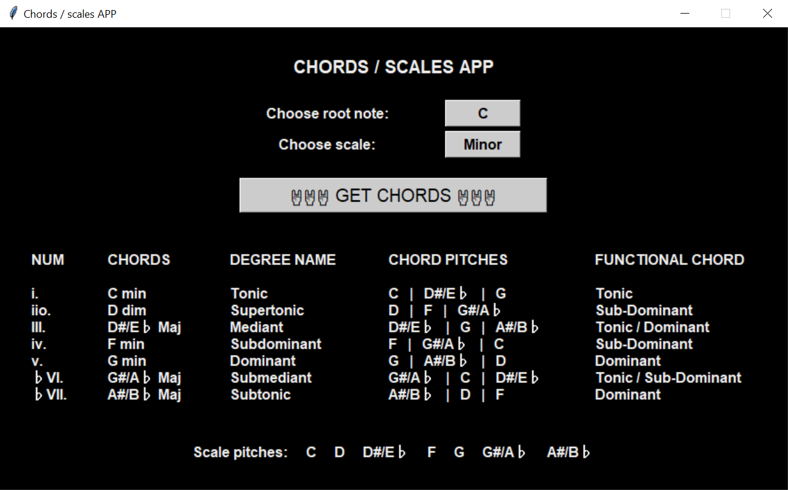

# CHORDS SCALES APP

A simple application written in Python with a tkinter GUI that returns the construction of chords in the indicated major or minor scale. It shows their number in scale, chord name, degree name, pitches, functions, and shows all the sounds from the scale. You can choose any note in major or minor scale. An application useful for someone who wants to create chord progressions.

